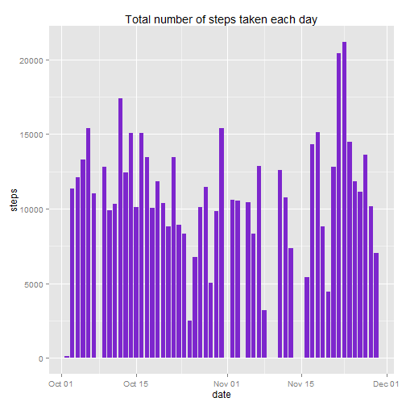
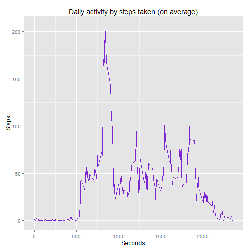
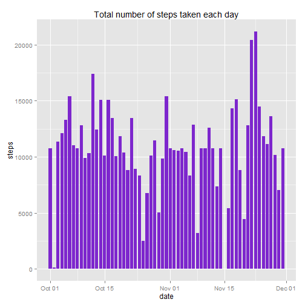
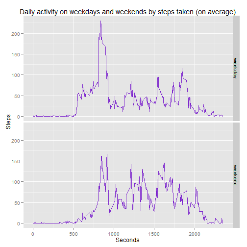

# Reproducible Research (Coursera, Oct. 2014)

## Peer Assessment 1

### 1. Load and preprocess data


```r
unzip("activity.zip")
dat = read.csv("activity.csv", 
	colClasses = c("integer", "Date", "integer"))
```

### 2.What is mean total number of steps taken per day?

Make a histogram of the total number of steps taken each day.


```r
datComplete = na.omit(dat)
library(ggplot2)
ggplot(datComplete, aes(date, steps)) +
	geom_bar(stat = "identity", fill = "purple3", width = 0.8) +
	labs(title = "Total number of steps taken each day")
```

 

Calculate and report the mean and median total number of steps 
taken per day


```r
stepsTotal = tapply(datComplete$steps, datComplete$date, sum)
```

**Mean:**


```r
mean(stepsTotal)
```

```
## [1] 10766.19
```

**Median**


```r
median(stepsTotal)
```

```
## [1] 10765
```

### 3. What is the average daily activity pattern?

Make a time series plot (i.e. type = "l") of the 5-minute interval 
(x-axis) and the average number of steps taken, averaged across all days 
(y-axis)


```r
stepsAverage = aggregate(datComplete$steps, 
	list(interval = datComplete$interval), mean)
ggplot(stepsAverage, aes(interval, x)) + geom_line(color = "purple3") +
	labs(title = "Daily activity by steps taken (on average)", 
	x = "Seconds", y = "Steps")
```

 

Which 5-minute interval, on average across all the days in the dataset, 
contains the maximum number of steps?


```r
stepsAverage[which.max(stepsAverage$x),]
```

```
##     interval        x
## 104      835 206.1698
```

### 4. Imputing missing values

Calculate and report the total number of missing values in the dataset 
(i.e. the total number of rows with NAs)


```r
sum(is.na(dat))
```

```
## [1] 2304
```

Devise a strategy for filling in all of the missing values in the dataset. 
The strategy does not need to be sophisticated. For example, you could use 
the mean/median for that day, or the mean for that 5-minute interval, etc.

*The mean for 5-minute intervals, being more precise, 
should give us the best approximation.*

Create a new dataset that is equal to the original dataset but with the missing 
data filled in.


```r
datFilled = dat
for (i in 1:nrow(datFilled)) {
	if (is.na(datFilled$steps[i])) {
	   datFilled$steps[i] = 
		stepsAverage$x[which(datFilled$interval[i] == datFilled$interval)]
		}
	}
```

Make a histogram of the total number of steps taken each day and 
Calculate and report the mean and median total number of steps taken per day.


```r
ggplot(datFilled, aes(date, steps)) +
	geom_bar(stat = "identity", fill = "purple3", width = 0.8) +
	labs(title = "Total number of steps taken each day")
```

 

**Mean:**


```r
stepsTotalFilled = tapply(datFilled$steps, datFilled$date, sum)
mean(stepsTotalFilled)
```

```
## [1] 10766.19
```

**Median**


```r
median(stepsTotalFilled)
```

```
## [1] 10766.19
```

Do these values differ from the estimates from the first part of 
the assignment?

*The mean is not different at all; the median differs, but not significantly*

What is the impact of imputing missing data on the estimates of the total 
daily number of steps?

*The mean and the median are now equal - a side effect of using averages to 
fill in the missing data. Overall, omitting rows with missing values did not
affect the result we have obtained now. If we replaced them with 0's, however,
it would make the number of values stay the same, but the mean and the median 
would go lower due to a huge amount of low values (those that equal 0).*

### 5. Are there differences in activity patterns between weekdays and weekends?

Create a new factor variable in the dataset with two levels – “weekday” and 
“weekend” indicating whether a given date is a weekday or weekend day.


```r
datFilled$dateWeekday = as.factor(weekdays(datFilled$date))
levels(datFilled$dateWeekday) = list(weekday = c("Friday", "Monday", 
	"Thursday", "Tuesday", "Wednesday"), 
	weekend = c("Saturday", "Sunday"))
```

Make a panel plot containing a time series plot (i.e. type = "l") of 
the 5-minute interval (x-axis) and the average number of steps taken, 
averaged across all weekday days or weekend days (y-axis).


```r
stepsFilled = aggregate(datFilled$steps, 
	list(interval = datFilled$interval, dateWeekday = datFilled$dateWeekday),
	mean)
ggplot(stepsFilled, aes(interval, x)) + geom_line(color = "purple3") +
	facet_grid(dateWeekday ~ .) +
	labs(title = "Daily activity on weekdays and weekends by steps taken (on average)", 
	x = "Seconds", y = "Steps")
```

 
